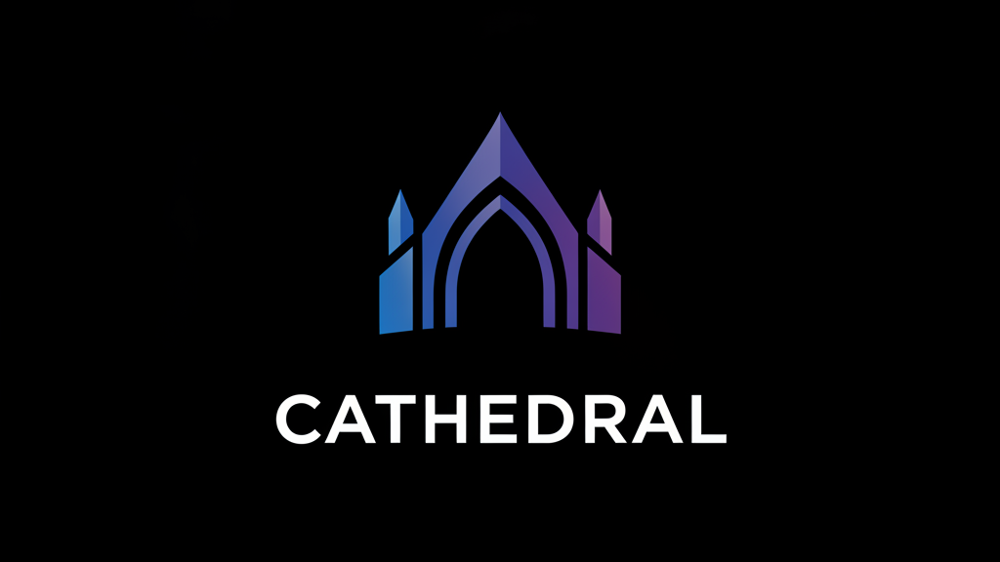

# Mem0 Cathedral MCP Server v12.1.0 (The Silent Oracle)

**Intelligent memory management for Claude Desktop** - AI extraction, auto-recall, silent operations, and advanced features.

## What's New in v12.1.0? 🚀

Complete rewrite bringing feature parity with the API version, including:

- **🤖 AI Extraction Mode**: Pass conversation messages, Mem0's AI extracts memories automatically
- **🧠 Intelligent Auto-Recall**: Proactive context retrieval with keyword reranking
- **🤫 Silent Operations**: Minimal responses (`{success: true/false}`) - no chat clutter
- **📂 Custom Categories**: 12 default categories for organized memories
- **🕸️ Graph Memory**: Entity relationship tracking for better context
- **🤝 Multi-Agent Support**: Track memories by agent_id and run_id
- **⚡ Hybrid Search**: Semantic (Mem0) + Lexical (keyword) matching
- **🎯 Extraction Instructions**: Guide AI extraction with custom prompts

## Features

### Core Operations
- ✅ **add-memory** - AI extraction OR manual save with quality checks
- ✅ **get-context** - Intelligent auto-recall with keyword reranking (NEW!)
- ✅ **search-memories** - Enhanced semantic search with categories & graph
- ✅ **get-all-memories** - Retrieve all memories for context loading
- ✅ **update-memory** - Modify existing memories
- ✅ **delete-memory** - Remove specific memories
- ✅ **consolidate-memories** - Find and merge similar memories

### Intelligence Features
- **AI Extraction**: Mem0's LLM automatically extracts memories from conversations
- **Quality Gating**: Minimum length, word count, and content validation
- **Duplicate Detection**: Semantic similarity checking before save
- **Keyword Reranking**: Hybrid semantic + lexical search (15% boost per keyword match)
- **Context Enrichment**: Auto-adds timestamps and clarifying prefixes
- **Consolidation**: Identifies redundant memories for cleanup
- **Silent Operations**: No verbose responses cluttering your chat

## Installation

### Requirements
- Python 3.10+
- Mem0 API key from https://app.mem0.ai/

### Setup

1. **Clone to your MCP tools location:**
   ```bash
   git clone <repo-url> C:\mcptools\mem0-cathedral-mcp
   cd C:\mcptools\mem0-cathedral-mcp
   ```

2. **Install Python dependencies:**
   ```bash
   # Using pip
   pip install -r requirements.txt

   # Or using uv (recommended)
   uv pip install -r requirements.txt
   ```

3. **Update Claude Desktop config** (`%APPDATA%\Claude\claude_desktop_config.json`):
   ```json
   {
     "mcpServers": {
       "mem0": {
         "command": "python",
         "args": ["C:\\mcptools\\mem0-cathedral-mcp\\server.py"],
         "env": {
           "MEM0_API_KEY": "your_mem0_api_key_here"
         }
       }
     }
   }
   ```

4. **Restart Claude Desktop**

## Configuration

### Environment Variables

- **MEM0_API_KEY** (required): Your Mem0 API key
- Default user ID: `el-jefe-principal`

### Quality Thresholds (in server.py)

Customize these constants to adjust filtering:

```python
MIN_MEMORY_LENGTH = 20      # Minimum characters
MIN_WORD_COUNT = 4          # Minimum words
SIMILARITY_THRESHOLD = 0.85 # Deduplication threshold (0.0-1.0)
```

## Usage Examples

### Adding Memories - AI Extraction Mode (RECOMMENDED)

**Let Mem0's AI extract automatically:**
```json
{
  "messages": [
    {"role": "user", "content": "I love pizza but hate pineapple on it"},
    {"role": "assistant", "content": "I'll remember your pizza preferences!"}
  ]
}
```
Mem0 extracts: "User loves pizza" + "User dislikes pineapple on pizza"

**Response:** `{"success": true}` (silent operation)

### Adding Memories - Legacy Mode

**Manual extraction with quality filtering:**
```json
{
  "content": "User prefers TypeScript over JavaScript for type safety"
}
```

**Response:** `{"success": true}` or `{"success": false}` (rejections are silent)

### Auto-Recall Context

**Get relevant memories for current conversation:**
```json
{
  "currentMessage": "What should I order for dinner?",
  "recentMessages": [
    {"role": "user", "content": "I'm hungry"},
    {"role": "assistant", "content": "What sounds good?"}
  ]
}
```

**Response:**
```json
{
  "context": "## User Context\n\n### Food Preferences\n- User loves pizza\n- User dislikes pineapple on pizza\n\n",
  "count": 2
}
```

### Searching Memories

**Enhanced search with categories and graph:**
```json
{
  "query": "programming languages",
  "categories": ["technical", "preferences"],
  "enableGraph": true,
  "limit": 10
}
```

**Use get-context instead for auto-recall** - it includes keyword reranking!

### Consolidating Memories

```
User: Clean up my memories
Claude: [Calls consolidate-memories with dryRun: true]

Response: Found 5 similar memory pairs:
  1. "User prefers Python" ↔ "User likes Python for data science" (similarity: 0.82)
  2. "Working on MCP project" ↔ "Building Mem0 MCP server" (similarity: 0.76)
  ...
```

## Architecture

- **Language**: Python 3.10+
- **MCP SDK**: `mcp` (official Python SDK)
- **Mem0 Client**: `mem0ai` (official Python SDK)
- **Protocol**: stdio (standard input/output)
- **Async**: Full async/await support

## Version Comparison

| Feature | Node.js (v1.0) | Python (v2.0) | Python (v12.1.0) |
|---------|---------------|---------------|------------------|
| Quality Filtering | ❌ | ✅ | ✅ |
| Deduplication | ❌ | ✅ | ✅ |
| Context Enrichment | ❌ | ✅ | ✅ |
| Memory Consolidation | ❌ | ✅ | ✅ |
| AI Extraction | ❌ | ❌ | ✅ |
| Auto-Recall | ❌ | ❌ | ✅ |
| Silent Operations | ❌ | ❌ | ✅ |
| Custom Categories | ❌ | ❌ | ✅ |
| Graph Memory | ❌ | ❌ | ✅ |
| Multi-Agent Support | ❌ | ❌ | ✅ |
| Keyword Reranking | ❌ | ❌ | ✅ |

## API Quality Features

### Memory Quality Assessment

Before saving, each memory is scored:
- ✅ **Good**: Length ≥20 chars, ≥4 words, has context indicators
- ⚠️ **Warning**: Very long (>500 chars) - may need summarization
- ❌ **Reject**: Too short, acknowledgments only, no context

### Context Indicators

Memories containing these terms get bonus points:
- Preferences: "prefer", "like", "love", "hate", "always", "never"
- Technical: "project", "tool", "language", "technology"
- Personal: "name is", "location", "timezone", "schedule"
- Goals: "goal", "objective", "plan", "want to", "need to"

## Troubleshooting

### Server not starting
- Check Python version: `python --version` (need 3.10+)
- Verify MEM0_API_KEY is set in config
- Check logs: `%APPDATA%\Claude\logs\mcp-server-mem0.log`

### Dependencies not found
```bash
# Reinstall dependencies
pip install --upgrade -r requirements.txt
```

### Too many memories rejected
Lower quality thresholds in [server.py:23-25](server.py#L23-L25):
```python
MIN_MEMORY_LENGTH = 10   # Was 20
MIN_WORD_COUNT = 2       # Was 4
```

### Search not triggering
Tool description has been optimized, but you can further customize at [server.py:170-178](server.py#L170-L178)

## Development Workflow

### Dev/Prod Split
- **Dev**: `C:\Users\jonat\OneDrive\Coding Projects\mem0-cathedral-mcp\`
- **Prod**: `C:\mcptools\mem0-cathedral-mcp\`

### Testing Locally

```bash
# Set API key
set MEM0_API_KEY=your_key_here

# Run server directly
python server.py

# Test with MCP inspector
mcp dev server.py
```

### Deploying to Production

```bash
cd C:\mcptools\mem0-cathedral-mcp
git pull
# Restart Claude Desktop
```

## Version History

- **12.1.0** - The Silent Oracle: AI extraction, auto-recall, silent operations, full feature parity with API version
- **2.0.0** - Python rewrite with intelligent filtering, deduplication, consolidation
- **1.0.0** - Original Node.js cathedral implementation

## Upgrade from v2.0.0 to v12.1.0

**What Changed:**
- Tool responses are now SILENT by default (`{success: true/false}`)
- New `get-context` tool for intelligent auto-recall
- `add-memory` now supports AI extraction via `messages` parameter
- Enhanced search with categories, graph memory, multi-agent support

**Migration Steps:**
1. Pull latest code: `git pull`
2. Restart Claude Desktop
3. Start using `get-context` for proactive memory recall!
4. Optionally use `messages` mode for better extraction

**Backward Compatible:** Old `add-memory` with `content` still works!

## Credits

Originally based on [mem0-cathedral-api](https://github.com/1818TusculumSt/mem0-cathedral-api) for Open WebUI.

v12.1.0 upgrade brings full feature parity between API and MCP versions. 🧠

## Default Memory Categories

The following 12 categories are used when AI extraction is enabled:

- `personal_information` - Name, location, age, family, background
- `preferences` - Likes, dislikes, favorites, personal tastes
- `work` - Career, projects, professional information
- `food_preferences` - Food likes, dislikes, dietary restrictions
- `technical` - Tech stack, tools, programming languages
- `goals` - Objectives, plans, aspirations, future intentions
- `health` - Health conditions, fitness routines, wellness
- `hobbies` - Interests, activities, pastimes
- `relationships` - Friends, family, colleagues, connections
- `location` - Places lived, traveled, or frequently visited
- `schedule` - Routines, availability, time preferences
- `communication` - Preferred communication styles and channels

You can override these by passing `customCategories` to `add-memory`.
